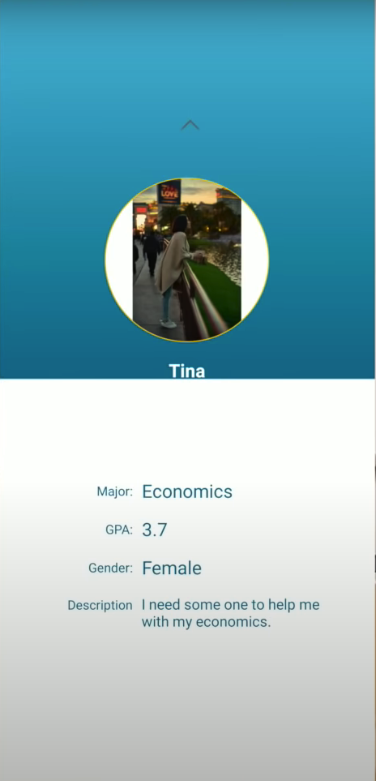
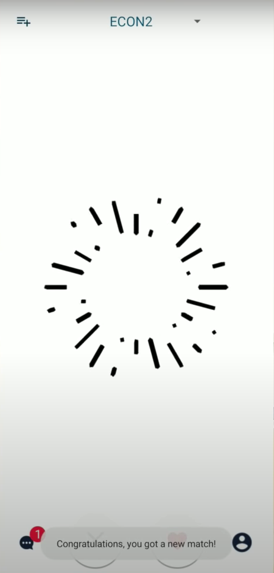
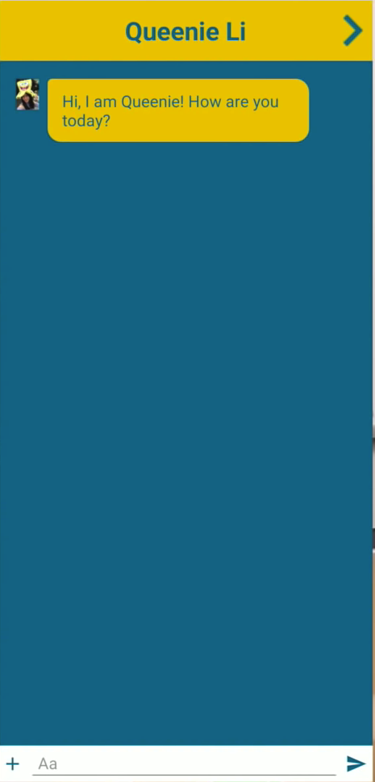
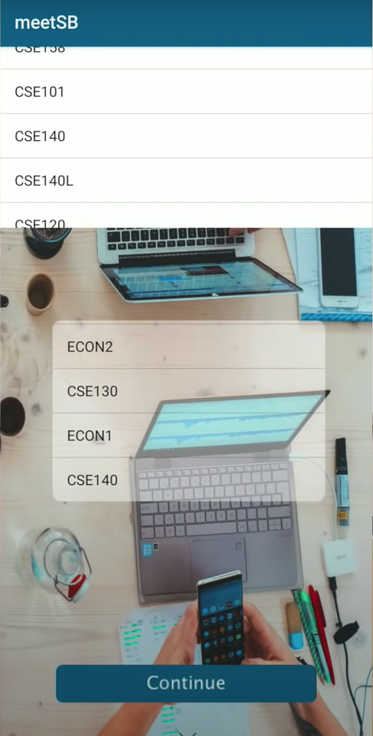

# Meet SB
Meet SB(Study buddy) is an Android App that helps UCSD Students formulate study groups. Registered users can use the app to find people who enrolled the same class as them, chat with their app friends and update their class schedule every quarter.

## Developer

Team SB
Denghui Chen		Kuanghanying Zhao	    Mu He	 
Sihan Sun		    Sutianyi Wen	      	Weilin Liu
Xinpei Tan			Yuting Xu		          Zhongyu Chen	
Zhaoyi Li

## Screen Shots
User information:

Main Activity Screen:

Chat Room Service:

Add Class page:

## Login Credentials
We have provided the following accounts for testing pruposes.
1.  Email Address: sis070@ucsd.edu
    Password: cse110gary

2.  Email Address: wel288@ucsd.edu
    Password: cse110gary
    
3.  Email Address: zhc180@ucsd.edu
    Password: cse110gary

## Requirement
Have at least two android phone running Android 5.0 (Lollipop) or later.

## How To Install
1. Download the APK file from the link down below:
   https://drive.google.com/drive/folders/1phsrO4qX7ICUZtoj2cr72IQPJ-iF8fiW?usp=sharing
2. Make sure "Install apps from unknown sources" is enbaled in the setting menu, specifically from the Android Security Setting.
3. Run the APK file from the downloads folder and install it.

## How To Run
1. Open App drawer on the Andriod Device.
2. Click and Run "meetSB"

## Known Bugs
1. Sometimes when uploading the profile picture, it may appears in side way. Do not worry, just click save and continue, it will appear normal in profile page.

2. After a new class is added, when the user is trying to switch to that newly added class, it will fail on the first time, just try again and it will work.

